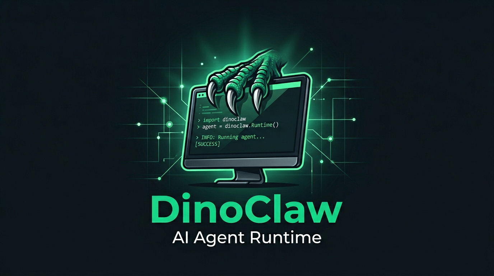

<p align="center">
  
</p>

<p align="center">
  <strong>AI for the people. Not the portfolio.</strong><br/>
  A desktop AI agent that runs on <em>your</em> machine, works for <em>you</em>, and costs <em>nothing</em>.<br/>
  Built by <a href="https://bostonai.io">BostonAi.io</a>
</p>

<p align="center">
  
  
  
  
</p>

---

## What is DinoClaw?

DinoClaw is a **free, open-source desktop AI agent** built for real people. Not enterprise teams. Not infrastructure engineers. Not developers with 10 years of experience. **You.**

The freelancer. The student. The small business owner. The curious tinkerer who wants AI to actually *do things* on their computer without a CS degree, a $20/month subscription, or a terminal window.

- Runs on your computer — no cloud, no server, no DevOps
- Has a real UI — not a terminal, not a chat widget, a full desktop app
- Does real work — files, commands, web searches, git, browser automation, desktop copilot
- Remembers you — persistent memory that learns your preferences
- Has personality — the Dino Creed system gives your agent a soul
- Connects everywhere — Telegram, Discord, webhooks, scheduled tasks
- Costs nothing — MIT licensed, forever free

**Double-click. Run. Done.**

## Why We Built This

> *"The biggest companies in the world are racing to build AI agents. They're charging $200/month for access. They're optimizing for enterprise contracts and Series B decks. They forgot that most people just want help."*
>
> — BostonAi.io

DinoClaw exists because we believe:

1. **AI agents should be free.** Not freemium. Free.
2. **AI should run on your machine.** Your data stays yours.
3. **You shouldn't need a terminal.** Point, click, go.
4. **Everyone deserves the same AI power.** Same tools, same capability, without the price tag.

## Quick Start

### Windows (easiest)
```
git clone https://github.com/AaronGrace978/DinoClaw.git
cd DinoClaw
launch.bat
```

### Linux / Steam Deck (easiest)
Switch to **Desktop Mode** on Steam Deck, open Konsole, then:

```
curl -fsSL https://raw.githubusercontent.com/AaronGrace978/DinoClaw/main/install.sh | bash
```

That downloads the latest release AppImage, adds DinoClaw to your app menu, and installs the `dinoclaw` command. To add it to Steam: **Steam → Add a Non-Steam Game → DinoClaw**.

**Build from source on Deck:**
```
git clone https://github.com/AaronGrace978/DinoClaw.git
cd DinoClaw
./build-linux.sh
./install.sh --file release/DinoClaw-*-linux-*.AppImage --launch
```

**Dev mode (contributors):**
```
./launch.sh
```

### Any Platform
```
git clone https://github.com/AaronGrace978/DinoClaw.git
cd DinoClaw
npm install
npm run dev
```

### Build Portable App
```
npm run build
npm run dist
# Output: release/ folder with .exe, .dmg, or AppImage

# Linux / Steam Deck AppImage only:
npm run dist:linux
# or
./build-linux.sh
```

### CLI Mode (headless)
```
npm run cli -- agent -m "List all files in this directory"
npm run cli -- agent -i          # interactive mode
npm run cli -- status            # show runtime status
```

### Talk Mode (voice)
Open the **Mission** tab, flip **Talk Mode** on, and speak your mission. DinoBuddy records your mic and transcribes it locally in the app (not the broken browser speech API). For best results, add a **Groq API key** in Settings (free tier includes Whisper). Or install local Whisper: `pip install openai-whisper`. Replies can be read aloud via text-to-speech.

## For the Everyday Person

You don't need to know what a "ReAct loop" is. You don't need to understand "IPC bridges" or "Zustand stores." Here's what matters:

1. **Download it.** Clone or download from GitHub.
2. **Double-click `launch.bat`.** It installs everything and opens the app.
3. **Pick a model.** Ollama for free local AI. Or paste an API key for cloud models.
4. **Give it a mission.** "Organize my downloads folder." "Find all TODO comments in my project." "What's the weather in Boston?"
5. **Watch it work.** See every step, every decision, every result in real-time.
6. **It remembers you.** Next time, it's faster because it learned your preferences.

That's it. No terminal. No config files. No Docker. No Kubernetes. No monthly bill.

## Features

### Desktop App
Full Electron desktop application with a 7-tab UI — Dashboard, Mission, Creed, Memory, Skills, Infrastructure, Settings. Real-time streaming shows you every step the agent takes. Approval modals with countdown timers for risky operations. **Stop button** to cancel a running mission. System tray support. Keyboard shortcuts.

### Conversation Register (from Pantheon)
DinoClaw detects whether you're sharing something personal, playing around, or asking for real work — and adjusts automatically. Personal moments get warmth and presence, not task suggestions. Playful banter stays fun. Missions get full tool power.

### Desktop Copilot (Windows)
Opt-in OS-level automation: launch apps, focus windows, move the mouse, click, type, hotkeys, scroll, and capture screenshots. Enable **Desktop automation** in Settings. Ideal for "open Notepad and type this" or Normandy-style app control. Mac/Linux support planned.

### The Dino Creed
The Creed is DinoClaw's soul. It defines who the agent is, how it relates to you, and what it will never do. Fully editable from the UI.

| Section | Purpose |
|---------|---------|
| **Identity** | Who DinoBuddy is — its role and character |
| **Relationship** | How it relates to you — loyalty, tone, trust |
| **Directives** | Operating rules — what it must always do |
| **Vows** | Hard limits — what it will never do |
| **Motto** | The agent's core belief |
| **Traits** | Personality sliders (analytical, creative, resourceful, etc.) |
| **Mood** | Adaptive mood based on recent performance |

Default motto: **"AI for the people. Not the portfolio."**

### 41 Built-in Tools

**Files & Shell**

| Tool | Risk | What it does |
|------|------|-------------|
| `list_directory` | Safe | List files and folders |
| `read_file` | Safe | Read file contents |
| `write_file` | Moderate | Write or overwrite files |
| `delete_file` | Risky | Delete a file |
| `execute_command` | Risky | Run shell commands |
| `run_script` | Risky | Write and optionally run scripts (Docker sandbox optional) |
| `code_search` | Safe | Regex search across files |
| `open_file_external` | Moderate | Open a file with the default app |
| `reveal_in_explorer` | Moderate | Highlight a file in the file manager |

**Web & Browser**

| Tool | Risk | What it does |
|------|------|-------------|
| `open_url` | Moderate | Open URL in system browser (handoff only) |
| `web_fetch` | Safe | Fetch web page content |
| `browser_navigate` | Moderate | Navigate in the DinoClaw browser session |
| `browser_snapshot` | Safe | Capture current page state |
| `browser_click` | Risky | Click an element |
| `browser_fill` / `browser_type` | Risky | Fill or append text in inputs |
| `browser_wait` | Safe | Wait and capture state |
| `browser_screenshot` | Safe | Screenshot the browser page |
| `browser_search` | Safe | Web search via DuckDuckGo |
| `browser_close` | Safe | Close the browser session |

**Desktop Copilot (Windows, opt-in)**

| Tool | Risk | What it does |
|------|------|-------------|
| `desktop_open_app` | Risky | Launch a desktop application |
| `desktop_wait_for_window` | Safe | Wait for a window to appear |
| `desktop_focus_window` | Risky | Focus a window by title/process |
| `desktop_list_windows` | Safe | List visible windows |
| `desktop_screenshot` | Moderate | Capture full desktop screenshot |
| `desktop_mouse_move` / `desktop_click` | Risky | Move cursor and click |
| `desktop_type_text` | Risky | Type into the focused control |
| `desktop_press_key` / `desktop_hotkey` | Risky | Send keys and shortcuts |
| `desktop_scroll` | Risky | Scroll the active window |
| `desktop_cursor_position` / `desktop_screen_size` | Safe | Cursor and screen dimensions |

**Memory, Git, System**

| Tool | Risk | What it does |
|------|------|-------------|
| `save_memory` / `recall_memory` | Safe | Store and search durable memories |
| `git_status` / `git_log` / `git_diff` | Safe | Git operations |
| `system_info` / `hardware_info` | Safe | OS and hardware info |
| `docker_exec` | Risky | Run commands in Docker sandbox |

### 7 AI Providers

| Provider | Type | Default Model |
|----------|------|---------------|
| Ollama | Local | llama3.2 |
| Ollama Cloud | Cloud | qwen3.5 |
| OpenAI / GPT | Cloud | gpt-4o |
| Anthropic / Claude | Cloud | claude-sonnet-4 |
| Google Gemini | Cloud | gemini-2.5-flash |
| Groq | Cloud | llama-3.3-70b |
| OpenRouter | Cloud | claude-sonnet-4 |

### Infrastructure

| System | What it does |
|--------|-------------|
| **Gateway API** | REST server with 6-digit pairing security. Endpoints: /health, /pair, /webhook, /status |
| **Telegram Bot** | Connect your agent to Telegram. Allowlist users, /status command, full goal execution |
| **Discord Bot** | Connect your agent to Discord. Allowlist users, !status command, message-based goals |
| **Scheduler** | Cron-like scheduled tasks. "every 30m", "daily at 09:00" syntax |
| **Docker Sandbox** | Containerized command execution with memory limits, network isolation, read-only rootfs |
| **Tunnel** | Expose gateway via Cloudflare or ngrok for external access |
| **Browser Tools** | Full browser session: navigate, snapshot, click, fill, type, search — with login/captcha checkpoints |
| **Desktop Copilot** | Windows OS assist: apps, windows, mouse, keyboard, scroll (opt-in via Settings) |
| **Service Manager** | Install as systemd user service (Linux) or Windows Task Scheduler |

### Security

| Layer | How |
|-------|-----|
| **Execution Policy** | 3 modes: `open`, `review-risky`, `lockdown` |
| **Tool Risk Tiers** | Every tool has a risk level: safe, moderate, risky |
| **Approval Modals** | Animated UI modal with 2-minute timeout for risky ops |
| **Audit Log** | Every tool execution is recorded with timestamp, risk, and approval status |
| **Gateway Pairing** | 6-digit one-time code → bearer token exchange |
| **Channel Allowlists** | Deny-by-default. Whitelist specific users. |
| **Docker Isolation** | No network, memory limits, PID limits, read-only rootfs |
| **Filesystem Scoping** | Blocked paths, workspace-relative resolution |

## Architecture

```
┌──────────────────────────────────────────────────────────┐
│  Electron Main Process                                    │
│  ┌──────────┐ ┌────────┐ ┌─────────┐ ┌───────────────┐ │
│  │ Runtime   │ │ Tools  │ │ Storage │ │ Infrastructure│ │
│  │ (ReAct)   │ │ (41)   │ │ (JSON)  │ │ Gateway       │ │
│  │ Provider  │ │ Browser│ │ Backup  │ │ Channels      │ │
│  │ Creed     │ │ Desktop│ │ Migrate │ │ Scheduler     │ │
│  │ Memory    │ │ HW     │ │         │ │ Tunnel        │ │
│  └─────┬─────┘ └───┬────┘ └────┬────┘ │ Service       │ │
│        │           │           │       └──────┬────────┘ │
│  ┌─────┴───────────┴───────────┴──────────────┴────────┐ │
│  │              IPC Bridge (preload)                    │ │
│  └──────────────────────┬───────────────────────────────┘ │
└─────────────────────────┼────────────────────────────────┘
                          │
┌─────────────────────────┼────────────────────────────────┐
│  Renderer (React 19)    │                                 │
│  ┌──────────────────────┴─────────────────────────────┐  │
│  │  Zustand Store → Tab UI                            │  │
│  │  Dashboard│Mission│Creed│Memory│Skills│Infra│Config │  │
│  └────────────────────────────────────────────────────┘  │
└──────────────────────────────────────────────────────────┘
```

## Tech Stack

| Layer | Tech |
|-------|------|
| Desktop Shell | Electron 41 |
| Frontend | React 19, Zustand, Lucide Icons |
| Build | Vite 7, vite-plugin-electron |
| Language | TypeScript 5.9 |
| Validation | Zod |
| AI | 7 providers (Ollama through OpenRouter) |
| Channels | Telegram Bot API, Discord Gateway API |
| Gateway | Node.js HTTP server |
| Sandbox | Docker CLI |
| Tunnel | Cloudflare, ngrok |

## Project Structure

```
DinoClaw/
├── electron/
│   ├── main.ts              # Electron entry, IPC handlers, system tray
│   ├── preload.ts           # Context bridge (40+ IPC methods)
│   ├── runtime.ts           # ReAct agent loop + infrastructure orchestration
│   ├── creed.ts             # Dino Creed + system prompt builder
│   ├── register.ts          # Personal/play/task conversation routing
│   ├── tools.ts             # 41-tool catalog + executor
│   ├── desktop-automation.ts # Windows desktop copilot (mouse, keys, windows)
│   ├── provider.ts          # 7 LLM provider implementations
│   ├── storage.ts           # JSON persistence + migration + backup
│   ├── gateway.ts           # REST API server with pairing
│   ├── scheduler.ts         # Cron/scheduling engine
│   ├── docker-runtime.ts    # Docker container sandbox
│   ├── tunnel.ts            # Cloudflare/ngrok tunnel manager
│   ├── hardware.ts          # Hardware detection (CPU, disk, USB, network)
│   ├── browser-tool.ts      # Web navigation + content extraction
│   ├── service.ts           # systemd/Windows service management
│   ├── cli.ts               # Headless CLI entry point
│   └── channels/
│       ├── telegram.ts      # Telegram bot (long polling)
│       ├── discord.ts       # Discord bot (WebSocket gateway)
│       └── manager.ts       # Channel lifecycle manager
├── src/
│   ├── App.tsx              # Main UI (7-tab layout)
│   ├── App.css              # 1400+ lines of handcrafted styles
│   ├── components/
│   │   └── CreedPanel.tsx   # Creed editor with trait bars + mood
│   ├── store/
│   │   └── useDinoStore.ts  # Zustand state (40+ actions)
│   └── shared/
│       └── contracts.ts     # Shared TypeScript contracts
├── assets/                  # Logos and icons
├── launch.bat               # Windows one-click dev launcher
├── build.bat                # Windows one-click build script
└── package.json
```

## The Movement

**AI agents shouldn't be a privilege. They should be a utility.**

If you agree, star this repo. Share it with someone who would never touch a terminal. Help us build the thing that nobody else will build — because there's no VC money in making tools for regular people.

---

<p align="center">
  <strong>DinoClaw v0.4</strong><br/>
  Built by <a href="https://bostonai.io">BostonAi.io</a> · Created by <a href="https://github.com/AaronGrace978">@AaronGrace978</a><br/>
  <em>AI for the people. Not the portfolio.</em><br/>
  MIT License · Free forever
</p>
